# 🌱 CropMate

CropMate is an **all-in-one** farming assistant mobile app tailored for agricultural applications, combining real-time sensors, location services, AI-driven crop recommendations. It is designed to help farmers optimize **crop cultivation** and **manage farm data** effectively. It leverages **Bluetooth sensors**, **manual data entry**, and **AI/ML driven** to provide crop recommendations and soil fertility predictions.

The app also includes a **View in Map** feature that enables farmers to visualize farm locations, and a **Collection feature for _Admins_** that allows them to gather data directly from the field and upload it to the system.

All data is securely stored and managed through **Supabase**, ensuring both **reliability** and **data security**. The app offers a **clean**, **themed interface** for smooth navigation and usability.

---

## ✨ Features

- **🔐 User Authentication:** Secure login & signup with role-based access (Farmer & Admin).
- **📡 Device Connectivity:** Connect and manage Bluetooth sensors for real-time environmental data monitoring.
- **📊 Farm Data Collection:** Collect soil & environmental data manually or via Bluetooth sensors, and visualize sensor readings.
- **🗺 View in Map:** Visualize geographic and farm locations on an interactive map.
- **📥 Admin Field Data Collection:** Admins can directly collect data from the field and upload it to the system.
- **🤖 AI/ML Integration:** Intelligent services for:
  - 🌾 Crop recommendations using AI/ML models
  - 🌱 Soil fertility predictions through AI/ML analysis
- **🗂 History Tracking:** Access previously recorded data and predictions for better insights.
- **🎨 Cross-Platform, User-Friendly UI:** A theme-aware, intuitive interface for both farmers and admins, ensuring smooth navigation and consistent user experience.
- **☁️ Supabase Integration:** Securely manage user profiles, authentication, and farm data. Effortlessly upload & access images via Supabase storage.

---

## 📸 Flow Screenshots

**1. Landing Page**

<table style="border-collapse: collapse;
    width: 100%;
    table-layout: fixed;
    margin-bottom: 20px;">
  <tr>
    <td style="text-align: center;
    padding: 6px;
    font-weight: 600;
    width: 50%;">Landing Page</td>
    <td style="width: 50%;
    border: none;
    background: none;"></td>
  </tr>
  <tr>
    <td style="text-align: center;
    padding: 6px;
    width: 50%;">
      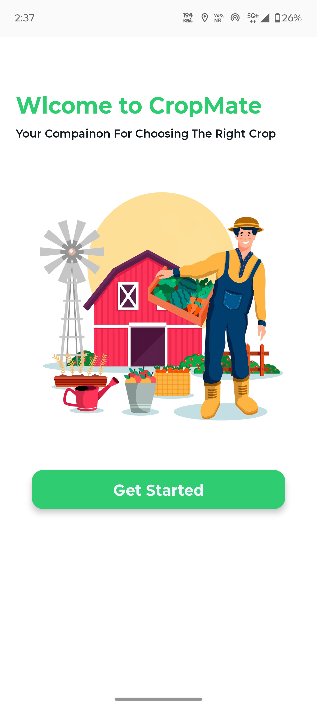
    </td>
    <td style="width: 50%;
    border: none;
    background: none;"></td>
  </tr>
</table>

**2. Authentication**

<table style="border-collapse: collapse;
    width: 100%;
    table-layout: fixed;
    margin-bottom: 20px;">
  <tr>
    <td style="text-align: center;
    padding: 6px;
    font-weight: 600;
    width: 50%;">Login Page</td>
    <td style="text-align: center;
    padding: 6px;
    font-weight: 600;
    width: 50%;">SignUp Page</td>
  </tr>
  <tr>
    <td style="text-align: center;
    padding: 6px;
    width: 50%;">
      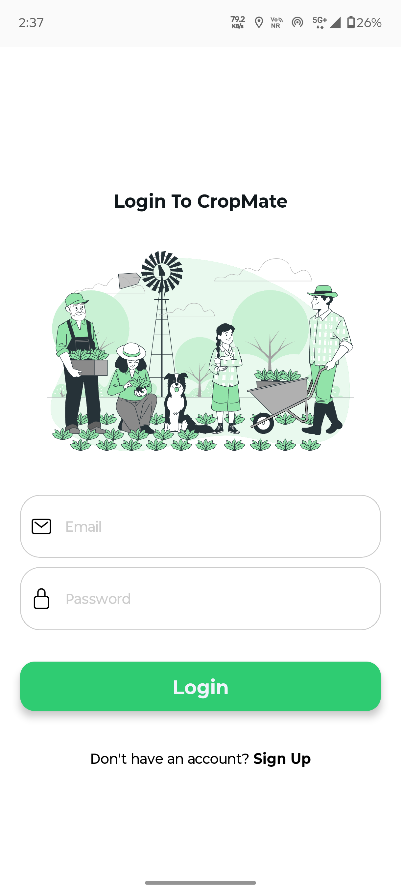
    </td>
    <td style="text-align: center;
    padding: 6px;
    width: 50%;">
      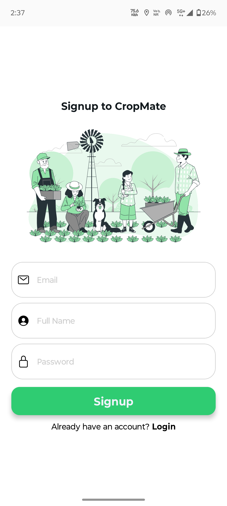
    </td>
  </tr>
</table>

**3. Home**

<table style="border-collapse: collapse;
    width: 100%;
    table-layout: fixed;
    margin-bottom: 20px;">
  <tr>
    <td style="text-align: center;
    padding: 6px;
    font-weight: 600;
    width: 50%;">User Home Page</td>
    <td style="text-align: center;
    padding: 6px;
    font-weight: 600;
    width: 50%;">Admin Home Page</td>
  </tr>
  <tr>
    <td style="text-align: center;
    padding: 6px;
    width: 50%;">
      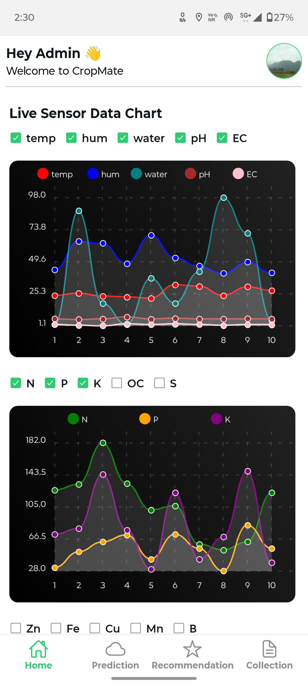
    </td>
    <td style="text-align: center;
    padding: 6px;
    width: 50%;">
      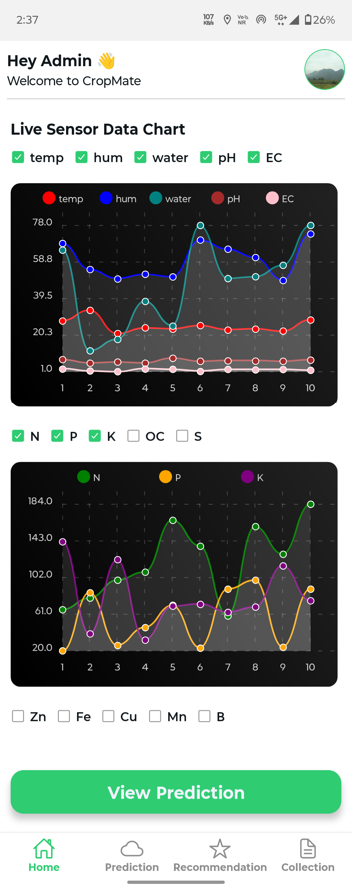
    </td>
  </tr>
</table>

**4. Predictions**

<table style="border-collapse: collapse;
    width: 100%;
    table-layout: fixed;
    margin-bottom: 20px;">
  <tr>
    <td style="text-align: center;
    padding: 6px;
    font-weight: 600;
    width: 50%;">Predictions Page</td>
    <td style="width: 50%;
    border: none;
    background: none;"></td>
  </tr>
  <tr>
    <td style="text-align: center;
    padding: 6px;
    width: 50%;">
      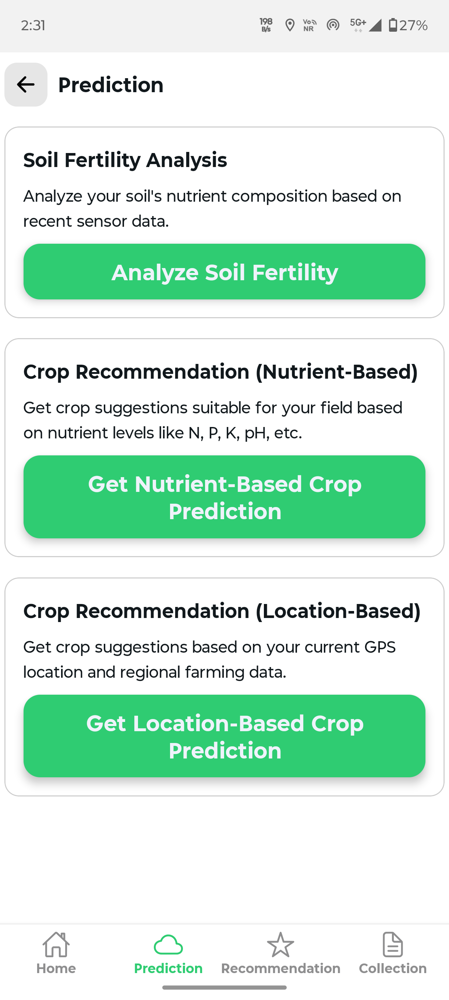
    </td>
    <td style="width: 50%;
    border: none;
    background: none;"></td>
  </tr>

  <tr>
    <td style="text-align: center;
    padding: 8px;
    font-weight: 600;
    font-size: 1.1em;
    border-bottom: 1px solid #ddd;" colspan="2">Check Soil Fertility</td>
  </tr>
  <tr>
    <td style="text-align: center;
    padding: 6px;
    width: 50%;">
      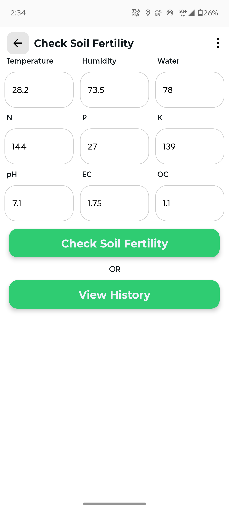
    </td>
    <td style="text-align: center;
    padding: 6px;
    width: 50%;">
      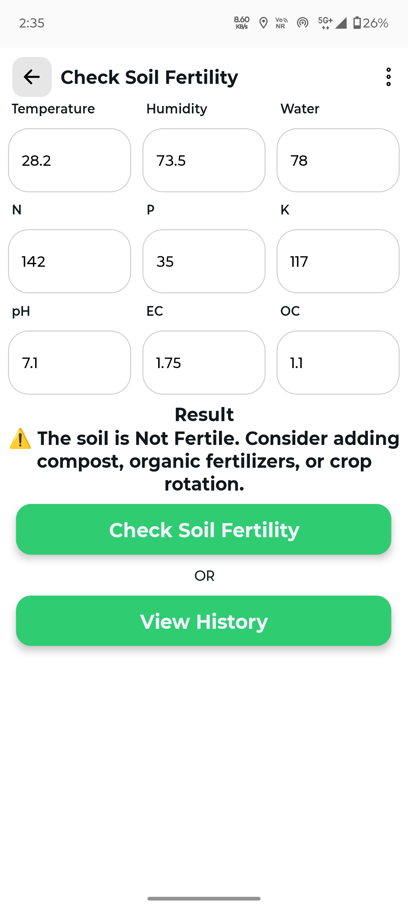
    </td>
  </tr>

  <tr>
    <td style="text-align: center;
    padding: 6px;
    font-weight: 600;
    width: 50%;">Soil Fertility History Page</td>
    <td style="width: 50%;
    border: none;
    background: none;"></td>
  </tr>
  <tr>
    <td style="text-align: center;
    padding: 6px;
    width: 50%;">
      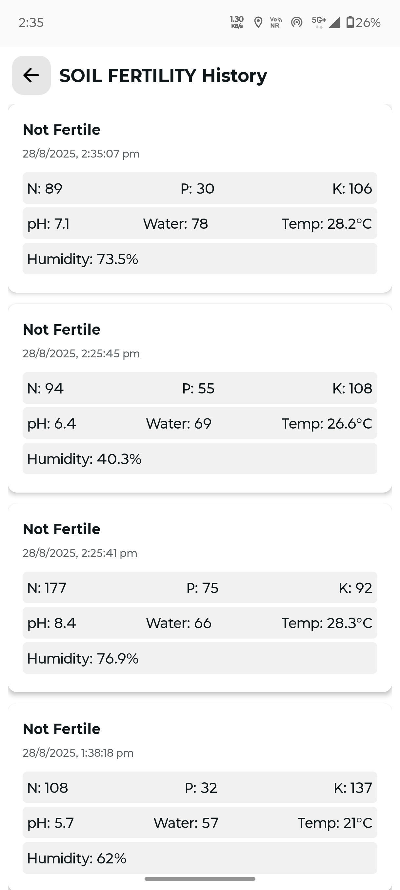
    </td>
    <td style="width: 50%;
    border: none;
    background: none;"></td>
  </tr>
  
  <tr>
    <td style="text-align: center;
    padding: 8px;
    font-weight: 600;
    font-size: 1.1em;
    border-bottom: 1px solid #ddd;" colspan="2">Crop Recommendation (Nutrient-based)</td>
  </tr>
  <tr>
    <td style="text-align: center;
    padding: 6px;
    width: 50%;">
      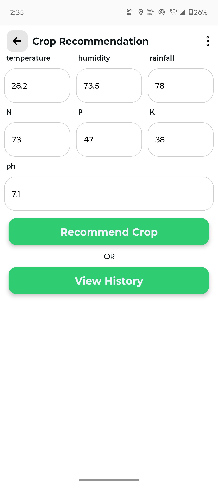
    </td>
    <td style="text-align: center;
    padding: 6px;
    width: 50%;">
      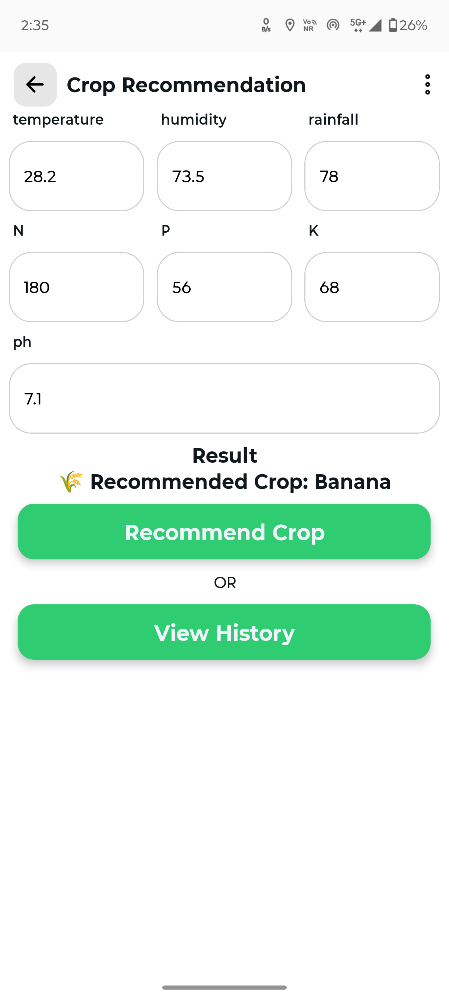
    </td>
  </tr>

  <tr>
    <td style="text-align: center;
    padding: 6px;
    font-weight: 600;
    width: 50%;">Crop Recommendation(Nutrient-based) History Page</td>
    <td style="width: 50%;
    border: none;
    background: none;"></td>
  </tr>
  <tr>
    <td style="text-align: center;
    padding: 6px;
    width: 50%;">
      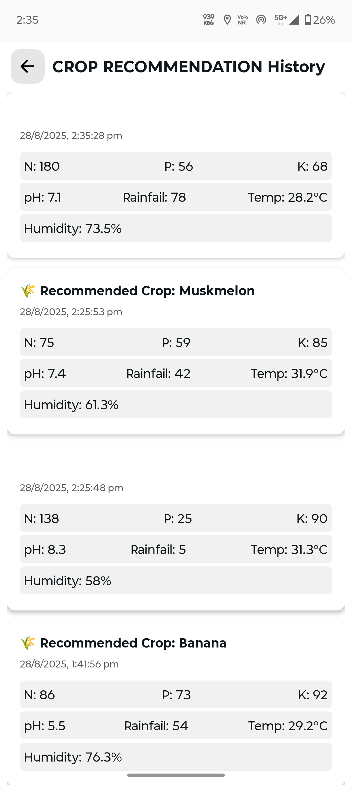
    </td>
    <td style="width: 50%;
    border: none;
    background: none;"></td>
  </tr>
  
  <tr>
    <td style="text-align: center;
    padding: 8px;
    font-weight: 600;
    font-size: 1.1em;
    border-bottom: 1px solid #ddd;" colspan="2">Crop Recommendation (Location-based)</td>
  </tr>
  <tr>
    <td style="text-align: center;
    padding: 6px;
    width: 50%;">
      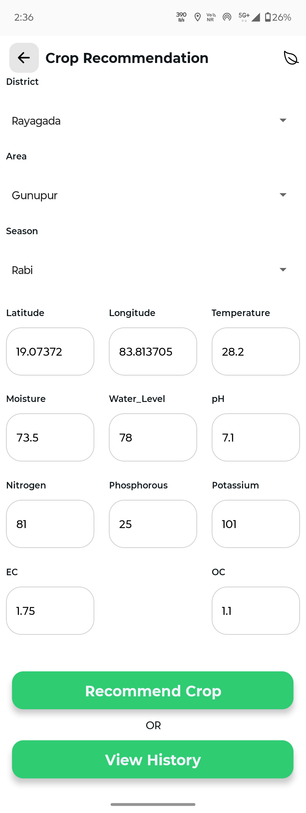
    </td>
    <td style="text-align: center;
    padding: 6px;
    width: 50%;">
      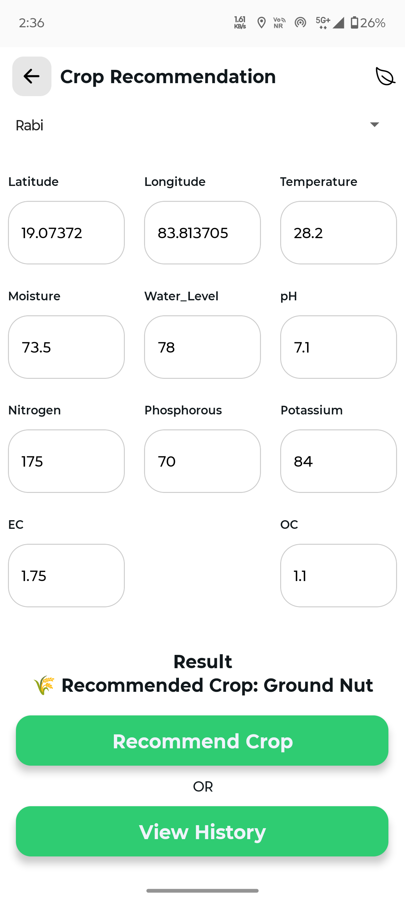
    </td>
  </tr>

  <tr>
    <td style="text-align: center;
    padding: 6px;
    font-weight: 600;
    width: 50%;">Crop Recommendation(Location-based) History Page</td>
    <td style="width: 50%;
    border: none;
    background: none;"></td>
  </tr>
  <tr>
    <td style="text-align: center;
    padding: 6px;
    width: 50%;">
      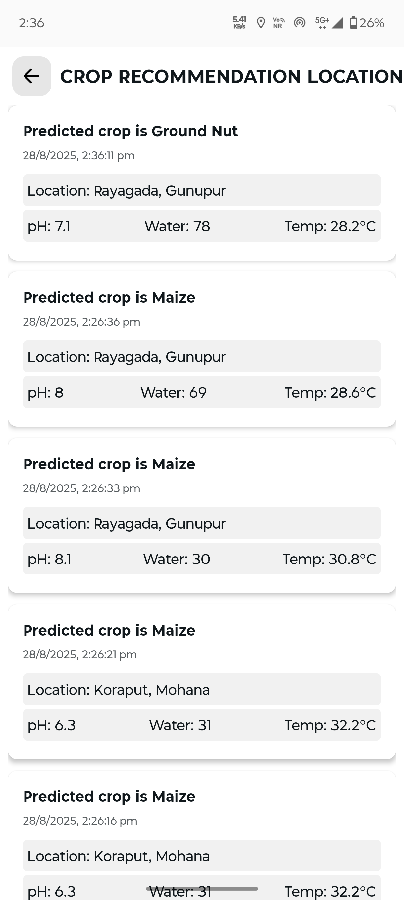
    </td>
    <td style="width: 50%;
    border: none;
    background: none;"></td>
  </tr>
</table>

**5. Recommendations**

<table style="border-collapse: collapse;
    width: 100%;
    table-layout: fixed;
    margin-bottom: 20px;">
  <tr>
    <td style="text-align: center;
    padding: 6px;
    font-weight: 600;
    width: 50%;">Recommendations Page</td>
    <td style="width: 50%;
    border: none;
    background: none;"></td>
  </tr>
  <tr>
    <td style="text-align: center;
    padding: 6px;
    width: 50%;">
      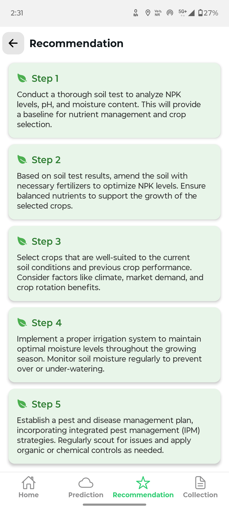
    </td>
    <td style="width: 50%;
    border: none;
    background: none;"></td>
  </tr>
</table>

**6. Collection (Admin)**

<table style="border-collapse: collapse;
    width: 100%;
    table-layout: fixed;
    margin-bottom: 20px;">
  <tr>
    <td style="text-align: center;
    padding: 6px;
    font-weight: 600;
    width: 50%;">Collection Page</td>
    <td style="text-align: center;
    padding: 6px;
    font-weight: 600;
    width: 50%;">With Details</td>
  </tr>
  <tr>
    <td style="text-align: center;
    padding: 6px;
    width: 50%;">
      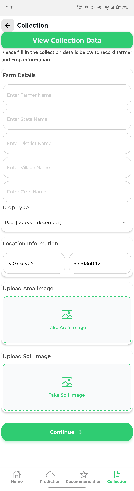
    </td>
    <td style="text-align: center;
    padding: 6px;
    width: 50%;">
      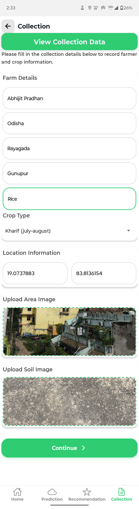
    </td>
  </tr>

  <tr>
    <td style="text-align: center;
    padding: 6px;
    font-weight: 600;
    width: 50%;">Submit</td>
    <td style="text-align: center;
    padding: 6px;
    font-weight: 600;
    width: 50%;">Success</td>
  </tr>
  <tr>
    <td style="text-align: center;
    padding: 6px;
    width: 50%;">
      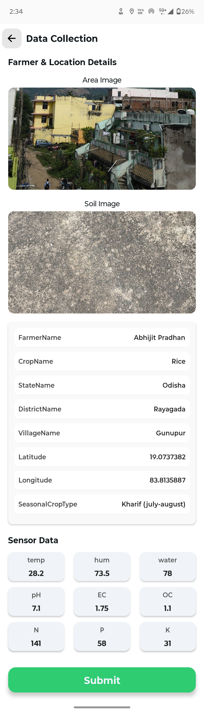
    </td>
    <td style="text-align: center;
    padding: 6px;
    width: 50%;">
      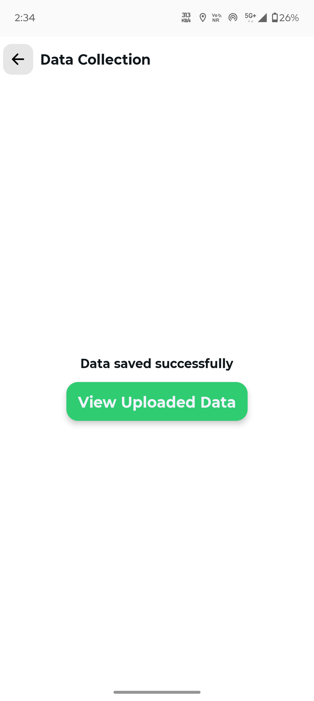
    </td>
  </tr>
</table>

**7. View Collection Data**

<table style="border-collapse: collapse;
    width: 100%;
    table-layout: fixed;
    margin-bottom: 20px;">
  <tr>
    <td style="text-align: center;
    padding: 6px;
    font-weight: 600;
    width: 50%;">View Collection Page</td>
    <td style="width: 50%;
    border: none;
    background: none;"></td>
  </tr>
  <tr>
    <td style="text-align: center;
    padding: 6px;
    width: 50%;">
      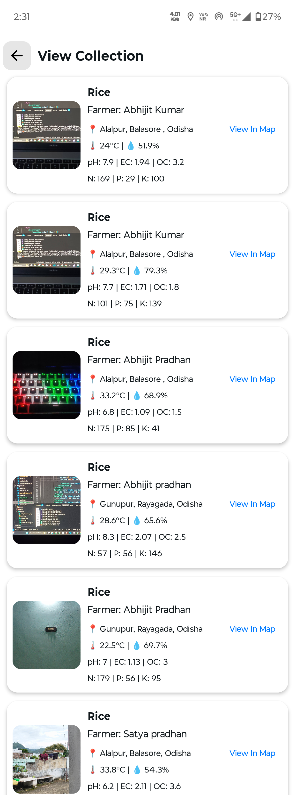
    </td>
    <td style="width: 50%;
    border: none;
    background: none;"></td>
  </tr>
</table>

**8. Profile**

<table style="border-collapse: collapse;
    width: 100%;
    table-layout: fixed;
    margin-bottom: 20px;">
  <tr>
    <td style="text-align: center;
    padding: 6px;
    font-weight: 600;
    width: 50%;">Profile Page</td>
    <td style="width: 50%;
    border: none;
    background: none;"></td>
  </tr>
  <tr>
    <td style="text-align: center;
    padding: 6px;
    width: 50%;">
      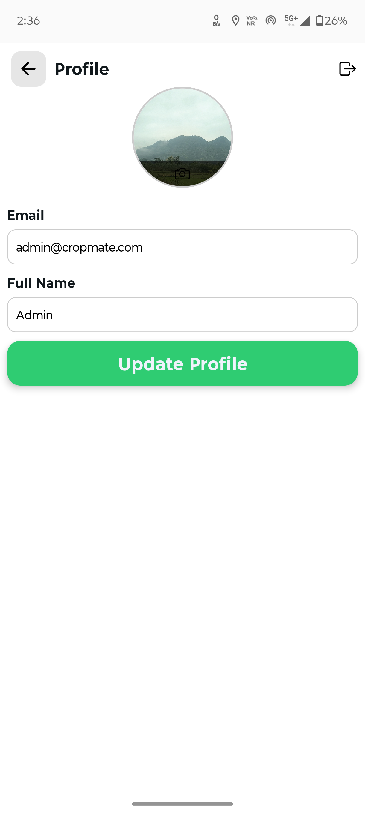
    </td>
    <td style="width: 50%;
    border: none;
    background: none;"></td>
  </tr>
</table>

**9. Logout**

<table style="border-collapse: collapse;
    width: 100%;
    table-layout: fixed;
    margin-bottom: 20px;">
  <tr>
    <td style="text-align: center;
    padding: 6px;
    font-weight: 600;
    width: 50%;">Logout Page</td>
    <td style="width: 50%;
    border: none;
    background: none;"></td>
  </tr>
  <tr>
    <td style="text-align: center;
    padding: 6px;
    width: 50%;">
      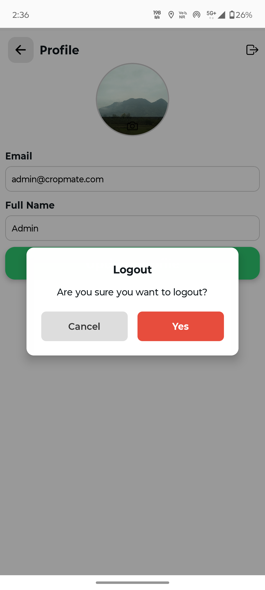
    </td>
    <td style="width: 50%;
    border: none;
    background: none;"></td>
  </tr>
</table>

---

## 🏗 Tech Stack

- **Frontend:** React Native (Expo)
- **Backend:** Supabase (Authentication, Database, Storage)
- **ML Service:** Custom Machine Learning API (Crop recommendation & fertility prediction)
- **Sensors:** Bluetooth sensors for soil/environment data
- **Maps:** React Native Maps
- **Deployment:** EAS Build (Expo Application Services)

---

## 👥 User Roles

- **Farmer/User:**

  - Login/Signup
  - Collect farm data from sensors(Bluetooth)
  - View crop predictions
  - View crop recommendations & soil fertility reports
  - Access history

- **Admin:**
  - Login/Signup
  - Manage users
  - Collect data directly from the field via sensors and upload it manually in **_Collections_** section
  - View farm location on map
  - Access the full database of farm data
  - View reports

---

## 🚀 Getting Started

Follow these steps to set up and run **CropMate** locally.

1. **Clone the Repository**

```bash
git clone https://github.com/your-org/cropmate-mobile.git
cd cropmate-mobile
```

2. **Install Dependencies**

```bash
npm install
```

3. **Setup Environment Variables**

   Create a `.env` file in the root directory and add:

```.env
SUPABASE_URL=your-supabase-url
SUPABASE_ANON_KEY=your-supabase-anon-key
ML_API_URL=your-ml-api-url
MAPS_API_KEY=your-google-maps-api-key
```

4. **Run the App in Development**

```bash
npx expo start
```

📱 Use the **Expo Go** app on your phone or emulator to preview the app.
<br>

##### Build with EAS

## 🚀 Build with EAS (Expo Application Services)

Follow these steps to build your app with [EAS Build](https://docs.expo.dev/build/introduction/):

1. **Install EAS CLI**

```bash
npm install -g eas-cli
```

2. **Login to Expo**

```bash
eas login
```

3. **Initialize EAS in the Project**

```bash
eas build:configure
```

This will create an `eas.json` file with default build profiles.

4. **Configure App Metadata**
   In your `app.json` or `app.config.js`, make sure you set:

- `name`
- `slug`
- `version`
- `ios.bundleIdentifier`
- `android.package`

5. **Run a Build**

- For Android:

```bash
eas build --platform android
```

- For iOS:

```bash
eas build --platform ios
```

- For both:

```bash
eas build --platform all
```

6. **Download Build**
   Once the cloud build finishes, EAS will provide you with a download link (APK, AAB, or IPA).

7. **(Optional) Submit to Stores**

- Android (Play Store):

```bash
eas submit --platform android
```

- iOS (App Store):

```bash
eas submit --platform ios
```

8. **(Optional) Publish OTA Updates**

```bash
eas update --branch production --message "Bug fixes and improvements"
```

---

## 🤝 Contributing

Contributions are welcome! Please fork the repo, create a branch, and submit a pull request.

---

## 📜 License

This project is licensed under the MIT License – see the [LICENSE ↗](https://choosealicense.com/licenses/mit/) file for details.
